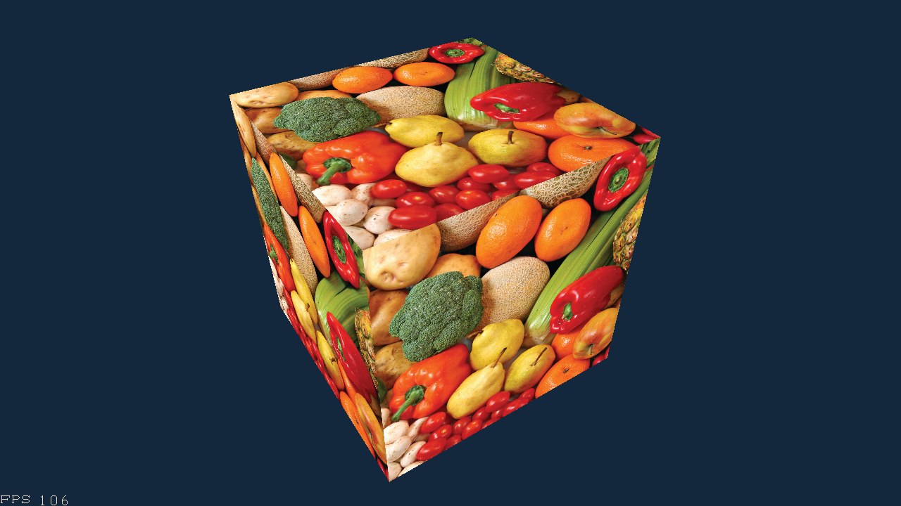
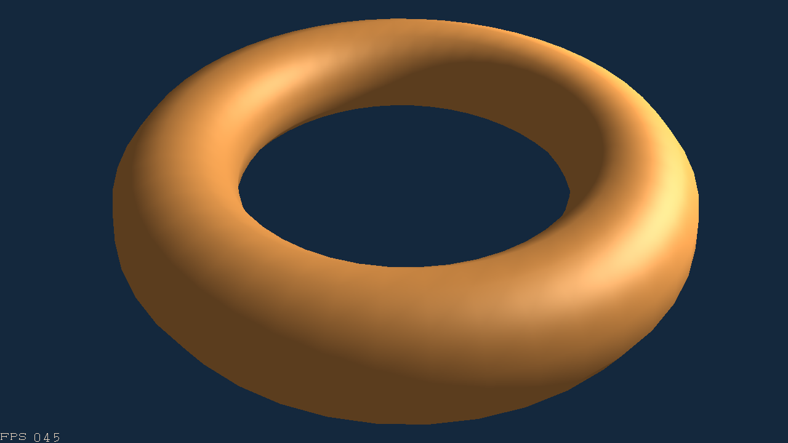
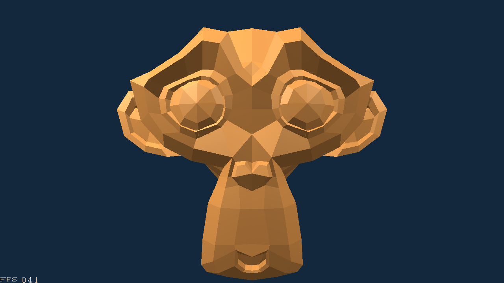

# CUPix

A CUDA rasterizer.

The details will be listed...

# Results

* depth test and blending

* face culling

* Gamma correction

* texture

* lighting, Phong / Blinn-Phong shading

* AA

No AA

MSAA

SSAA

* Shadertoy

More imgae results and some video results can be found in the `result` directory.
